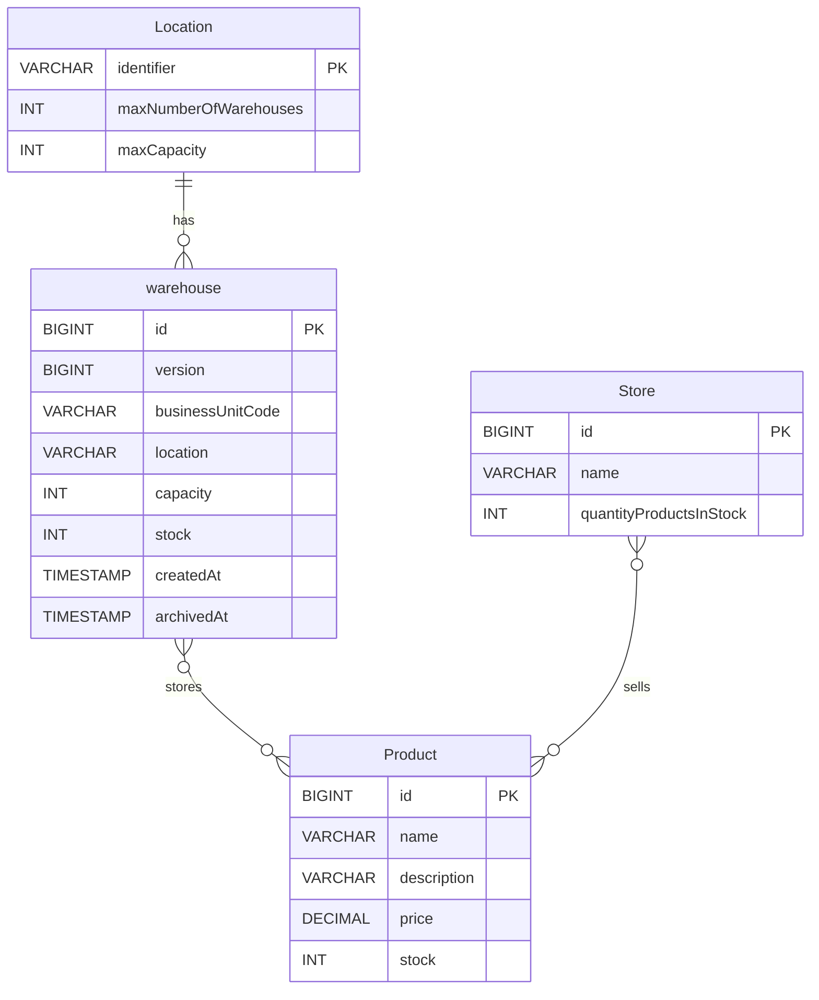

# Database Structure

Here is the Entity-Relationship (ER) diagram for the persistence entities in the system. 

The primary relational data models mapped to the database via Hibernate are `DbWarehouse` (mapped to the `warehouse` table), `Store`, and `Product`. The `Location` entity exists conceptually and is referenced by the warehouse's location field.

### Entity Breakdown

1. **`warehouse`** (Mapped by `DbWarehouse.java`)
   - Uses an auto-generated internal `id` as the primary key.
   - Includes `@Version` for optimistic locking (`version`).
   - `businessUnitCode` acts as a unique natural key.
   - Associated with a conceptual `Location` via the `location` string column.

2. **`Store`** (Mapped by `Store.java`)
   - Has an auto-generated `id`.
   - `name` acts as a unique constraint.
   - Tracks its own stock level directly via `quantityProductsInStock`.

3. **`Product`** (Mapped by `Product.java`)
   - Auto-generated `id`.
   - `name` acts as a unique constraint.
   - Tracks its global inventory availability via `stock`.

4. **`Location`** Concept
   - While `Location` is implemented as a Java `record` for domain boundaries rather than a JPA entity, it acts as a logical entity that constraints how many of the `warehouse` rows can share the same `location` value.
